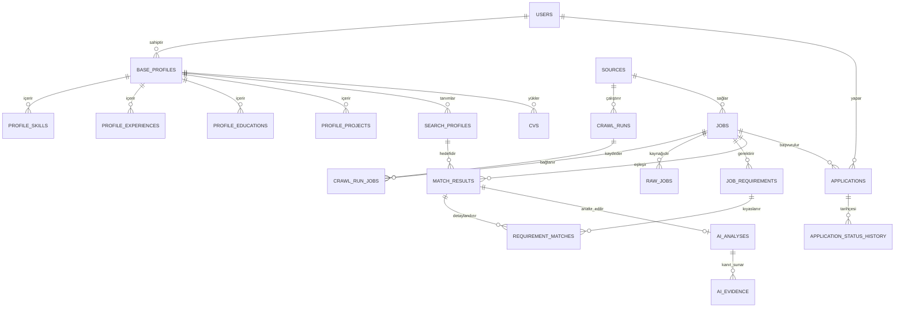

# Personal Job Intelligence — PostgreSQL Veritabanı ve API Tasarımı

Bu doküman, sistemin PostgreSQL veritabanı şemasını, tablo yapılarını, kısıtlarını (constraints), veri tiplerini ve FastAPI REST API uç noktalarını (endpoints) detaylandırır.

- **İlgili Dokümanlar:**
  - [01_mvp_technical_design.md](file:///c:/Users/aharu/Documents/GitHub/Crawler/docs/01_mvp_technical_design.md) — 45 Maddelik MVP Teknik Tasarım & Mimari Kararlar
  - [03_data_model_and_architecture.md](file:///c:/Users/aharu/Documents/GitHub/Crawler/docs/03_data_model_and_architecture.md) — ER İlişkileri, SQLAlchemy Modelleri, Clean Architecture & Adapter Mimarisi

---

## 1. PostgreSQL Ana Entity İlişki Modeli

### Kullanıcı, Profil ve Başvuru Varlıkları
```
User
 │
 ├── BaseProfile
 │      │
 │      ├── ProfileSkill
 │      ├── ProfileExperience
 │      ├── ProfileEducation
 │      ├── ProfileProject
 │      │
 │      └── SearchProfile
 │
 ├── Application
 │        │
 │        └── ApplicationStatusHistory
 │
 └── CV
```

### Kaynak, Tarama ve İlan Varlıkları
```
Source
 │
 └── CrawlRun
       │
       └── crawl_run_jobs (N:M İlişki)
             │
             └── Job

Job
 ├── RawJob (1:1 / 1:N)
 ├── JobRequirement (1:N)
 ├── MatchResult (1:N - SearchProfile ile eşleşme)
 │      ├── RequirementMatch (1:N)
 │      └── AIAnalysis (1:1)
 │             └── AIEvidence (1:N)
 └── Application (1:1 - Kullanıcı ile başvuru ilişkisi)
```

### Mermaid ER Diyagramı


---

## 2. Temel Tablolar ve Şema Detayları

### 2.1 `users`
MVP'de sistem tek kullanıcı tarafından lokalde kullanılacak olsa bile, ileride authentication, multi-tenant geçişi ve veri izolasyonunu kolaylaştırmak için ana `User` entity'si korunur.

| Kolon | Veri Tipi | Kısıtlar | Açıklama |
| :--- | :--- | :--- | :--- |
| `id` | `UUID` | `PRIMARY KEY`, Default: `gen_random_uuid()` | Tekil kullanıcı kimliği |
| `created_at` | `TIMESTAMP WITH TIME ZONE` | `NOT NULL`, Default: `now()` | Oluşturulma zamanı |
| `updated_at` | `TIMESTAMP WITH TIME ZONE` | `NOT NULL`, Default: `now()` | Güncellenme zamanı |

---

### 2.2 `base_profiles`
Kullanıcının kariyer ve yeteneklerine dair stabil ana profil kaydı.

| Kolon | Veri Tipi | Kısıtlar | Açıklama |
| :--- | :--- | :--- | :--- |
| `id` | `UUID` | `PRIMARY KEY`, Default: `gen_random_uuid()` | Profil tekil kimliği |
| `user_id` | `UUID` | `NOT NULL`, `FOREIGN KEY (users.id)` ON DELETE CASCADE | Kullanıcı referansı |
| `name` | `VARCHAR(255)` | `NOT NULL` | Profil başlığı / Kullanıcı tam adı |
| `summary` | `TEXT` | `NULLABLE` | Genel profesyonel özet |
| `created_at` | `TIMESTAMP WITH TIME ZONE` | `NOT NULL`, Default: `now()` | Oluşturulma zamanı |
| `updated_at` | `TIMESTAMP WITH TIME ZONE` | `NOT NULL`, Default: `now()` | Güncellenme zamanı |

#### Profil Alt Tabloları (Normalize Edilmiş Yetkinlikler)
Yetenek, deneyim, eğitim ve projelerin ayrı tablolarda modellenmesi deterministik eşleştirme motorunun sorgu hızını ve doğruluğunu artırır:

#### `profile_skills`
- `id` (`UUID`, PK)
- `base_profile_id` (`UUID`, FK -> `base_profiles.id`, ON DELETE CASCADE)
- `name` (`VARCHAR(150)`, NOT NULL) — Örn: Python, Docker, PostgreSQL
- `category` (`VARCHAR(100)`, NULLABLE) — Language, Framework, Tool, Soft Skill
- `years_of_experience` (`NUMERIC(4,1)`, NULLABLE) — Yıl bazlı tecrübe
- `level` (`VARCHAR(50)`, NULLABLE) — Beginner, Intermediate, Advanced, Expert
- `created_at`, `updated_at`

#### `profile_experiences`
- `id` (`UUID`, PK)
- `base_profile_id` (`UUID`, FK -> `base_profiles.id`, ON DELETE CASCADE)
- `company` (`VARCHAR(255)`, NOT NULL) — Şirket adı
- `title` (`VARCHAR(255)`, NOT NULL) — Pozisyon unvanı
- `description` (`TEXT`, NULLABLE) — Sorumluluklar ve başarılar
- `start_date` (`DATE`, NOT NULL) — Başlangıç tarihi
- `end_date` (`DATE`, NULLABLE) — Bitiş tarihi (boşsa devam ediyor)
- `is_current` (`BOOLEAN`, Default: `false`) — Mevcut iş durumu
- `skills_used` (`JSONB`, Default: `'[]'`) — Pozisyonda kullanılan teknolojiler listesi
- `created_at`, `updated_at`

#### `profile_educations`
- `id` (`UUID`, PK)
- `base_profile_id` (`UUID`, FK -> `base_profiles.id`, ON DELETE CASCADE)
- `school` (`VARCHAR(255)`, NOT NULL) — Üniversite / Kurum
- `degree` (`VARCHAR(100)`, NOT NULL) — Bachelor's, Master's, PhD, Associate
- `field_of_study` (`VARCHAR(255)`, NOT NULL) — Bilgisayar Müh., Matematik Müh. vb.
- `start_year` (`INT`, NULLABLE)
- `end_year` (`INT`, NULLABLE)
- `created_at`, `updated_at`

#### `profile_projects`
- `id` (`UUID`, PK)
- `base_profile_id` (`UUID`, FK -> `base_profiles.id`, ON DELETE CASCADE)
- `title` (`VARCHAR(255)`, NOT NULL) — Proje başlığı
- `description` (`TEXT`, NULLABLE) — Proje detayları ve hedefleri
- `skills_used` (`JSONB`, Default: `'[]'`) — Projede kullanılan araç ve diller
- `url` (`TEXT`, NULLABLE) — GitHub repo veya canlı demo linki
- `created_at`, `updated_at`

---

### 2.3 `search_profiles`
Kullanıcının farklı arama hedeflerini (Target Roles, lokasyon, kıdem vb.) temsil eder. Bir Base Profile'ın birden fazla Search Profile'ı olabilir.

```
Base Profile
│
├── AI Engineer Search
├── Data Scientist Search
└── Software Engineer Search
```

| Kolon | Veri Tipi | Kısıtlar | Açıklama |
| :--- | :--- | :--- | :--- |
| `id` | `UUID` | `PRIMARY KEY`, Default: `gen_random_uuid()` | Arama profili kimliği |
| `base_profile_id` | `UUID` | `NOT NULL`, `FOREIGN KEY (base_profiles.id)` ON DELETE CASCADE | Ana profil referansı |
| `name` | `VARCHAR(150)` | `NOT NULL` | Profil hedef adı (Örn: "AI Engineer") |
| `target_roles` | `JSONB` | `NOT NULL`, Default: `'[]'` | Hedeflenen pozisyon unvanları listesi |
| `seniority` | `VARCHAR(50)` | `NULLABLE` | New Grad, Junior, Mid, Senior, Lead |
| `target_skills` | `JSONB` | `NOT NULL`, Default: `'[]'` | Öncelikli aranan yetenekler listesi |
| `locations` | `JSONB` | `NOT NULL`, Default: `'[]'` | Tercih edilen şehir/ülkeler |
| `work_modes` | `JSONB` | `NOT NULL`, Default: `'[]'` | Remote, Hybrid, On-site tercihleri |
| `industries` | `JSONB` | `NOT NULL`, Default: `'[]'` | Tercih edilen sektörler |
| `salary_min` | `NUMERIC(12,2)` | `NULLABLE` | Minimum maaş beklentisi |
| `salary_max` | `NUMERIC(12,2)` | `NULLABLE` | Maksimum maaş beklentisi |
| `created_at` | `TIMESTAMP WITH TIME ZONE` | `NOT NULL`, Default: `now()` | Oluşturulma tarihi |
| `updated_at` | `TIMESTAMP WITH TIME ZONE` | `NOT NULL`, Default: `now()` | Güncellenme tarihi |

---

### 2.4 `sources`
ATS ve iş ilanı kaynaklarının registry tablosudur. Statik URL yerine dinamik adapter yapılandırmaları tutulur.

| Kolon | Veri Tipi | Kısıtlar | Açıklama |
| :--- | :--- | :--- | :--- |
| `id` | `UUID` | `PRIMARY KEY`, Default: `gen_random_uuid()` | Kaynak kimliği |
| `name` | `VARCHAR(150)` | `NOT NULL` | Kaynak adı (Örn: Getir Greenhouse) |
| `company` | `VARCHAR(150)` | `NULLABLE` | İlgili şirket adı |
| `url` | `TEXT` | `NOT NULL` | Ana kariyer sayfası / API endpoint URL |
| `country` | `VARCHAR(50)` | `NULLABLE` | Kaynağın ülkesi (TR, Global vb.) |
| `ats_type` | `VARCHAR(50)` | `NOT NULL` | greenhouse, lever, workday, ashby, custom |
| `active` | `BOOLEAN` | `NOT NULL`, Default: `true` | Taramaya dahil edilme durumu |
| `adapter_config` | `JSONB` | `NOT NULL`, Default: `'{}'` | Adaptöre özel ayarlar (`board_token` vb.) |
| `pagination_config` | `JSONB` | `NOT NULL`, Default: `'{}'` | Sayfalama tipi, limit, offset parametreleri |
| `endpoint_config` | `JSONB` | `NOT NULL`, Default: `'{}'` | Header, payload veya özel query parametreleri |
| `rate_limit_config` | `JSONB` | `NOT NULL`, Default: `'{}'` | İstekler arası bekleme süresi, max retry |
| `metadata` | `JSONB` | `NOT NULL`, Default: `'{}'` | İlave etiketler ve serbest meta bilgiler |
| `created_at` | `TIMESTAMP WITH TIME ZONE` | `NOT NULL`, Default: `now()` | Oluşturulma zamanı |
| `updated_at` | `TIMESTAMP WITH TIME ZONE` | `NOT NULL`, Default: `now()` | Güncellenme zamanı |

---

### 2.5 `crawl_runs` ve `crawl_run_jobs`
Her tarama operasyonunun audit ve performans kaydı.

#### `crawl_runs`
| Kolon | Veri Tipi | Kısıtlar | Açıklama |
| :--- | :--- | :--- | :--- |
| `id` | `UUID` | `PRIMARY KEY`, Default: `gen_random_uuid()` | Çalışma kimliği |
| `source_id` | `UUID` | `NOT NULL`, `FOREIGN KEY (sources.id)` ON DELETE CASCADE | Taranan kaynak |
| `started_at` | `TIMESTAMP WITH TIME ZONE` | `NOT NULL`, Default: `now()` | Başlama zamanı |
| `finished_at` | `TIMESTAMP WITH TIME ZONE` | `NULLABLE` | Bitiş zamanı |
| `status` | `VARCHAR(50)` | `NOT NULL` | RUNNING, COMPLETED, FAILED, PARTIAL |
| `jobs_found` | `INT` | `NOT NULL`, Default: `0` | Sayfada/API'de görülen toplam ilan |
| `jobs_created` | `INT` | `NOT NULL`, Default: `0` | Yeni eklenen ilan sayısı |
| `jobs_updated` | `INT` | `NOT NULL`, Default: `0` | Güncellenen ilan sayısı |
| `jobs_closed` | `INT` | `NOT NULL`, Default: `0` | Kaynakta kalkıp kapatılan ilan |
| `error_count` | `INT` | `NOT NULL`, Default: `0` | Alınan hata sayısı |
| `created_at` | `TIMESTAMP WITH TIME ZONE` | `NOT NULL`, Default: `now()` | Kayıt zamanı |

#### `crawl_run_jobs` (Çoktan-Çoğa Ara Tablo)
| Kolon | Veri Tipi | Kısıtlar | Açıklama |
| :--- | :--- | :--- | :--- |
| `crawl_run_id` | `UUID` | `NOT NULL`, `FOREIGN KEY (crawl_runs.id)` ON DELETE CASCADE | Run referansı |
| `job_id` | `UUID` | `NOT NULL`, `FOREIGN KEY (jobs.id)` ON DELETE CASCADE | İlan referansı |
| `action` | `VARCHAR(50)` | `NOT NULL` | CREATED, UPDATED, UNCHANGED, CLOSED |

*Bileşik Birincil Anahtar:* `PRIMARY KEY (crawl_run_id, job_id)`

---

### 2.6 `jobs`
Tüm kaynaklardan normalize edilmiş **Canonical Job** ana tablosu.

| Kolon | Veri Tipi | Kısıtlar | Açıklama |
| :--- | :--- | :--- | :--- |
| `id` | `UUID` | `PRIMARY KEY`, Default: `gen_random_uuid()` | İlan tekil kimliği |
| `source_id` | `UUID` | `NOT NULL`, `FOREIGN KEY (sources.id)` ON DELETE RESTRICT | Alındığı kaynak |
| `external_job_id` | `VARCHAR(255)` | `NULLABLE` | Kaynaktaki orijinal ilan ID'si |
| `canonical_url` | `TEXT` | `NOT NULL` | Standartlaştırılmış tekil URL |
| `company` | `VARCHAR(255)` | `NOT NULL` | Şirket adı |
| `title` | `VARCHAR(255)` | `NOT NULL` | İlan başlığı |
| `description` | `TEXT` | `NOT NULL` | Tam iş ilanı metni |
| `responsibilities`| `TEXT` | `NULLABLE` | Sorumluluklar |
| `location` | `VARCHAR(255)` | `NULLABLE` | Şehir / Ülke bilgisi |
| `work_mode` | `VARCHAR(50)` | `NULLABLE` | Remote, Hybrid, On-site |
| `employment_type` | `VARCHAR(50)` | `NULLABLE` | Full-time, Part-time, Contract, Internship |
| `salary` | `VARCHAR(255)` | `NULLABLE` | Maaş metni veya aralığı |
| `published_at` | `TIMESTAMP WITH TIME ZONE` | `NULLABLE` | İlanın yayınlanma tarihi |
| `first_seen_at` | `TIMESTAMP WITH TIME ZONE` | `NOT NULL`, Default: `now()` | Sistemde ilk görülme anı |
| `last_seen_at` | `TIMESTAMP WITH TIME ZONE` | `NOT NULL`, Default: `now()` | Son taramada görülme anı |
| `closed_at` | `TIMESTAMP WITH TIME ZONE` | `NULLABLE` | Yayından kalkma anı |
| `status` | `VARCHAR(50)` | `NOT NULL`, Default: `'ACTIVE'` | ACTIVE, CLOSED |
| `content_hash` | `VARCHAR(64)` | `NOT NULL` | İçerik değişim kontrolü için SHA-256 |
| `created_at` | `TIMESTAMP WITH TIME ZONE` | `NOT NULL`, Default: `now()` | Oluşturulma tarihi |
| `updated_at` | `TIMESTAMP WITH TIME ZONE` | `NOT NULL`, Default: `now()` | Güncellenme tarihi |

#### Unique Constraints & Kural:
- `UNIQUE (source_id, external_job_id)` — `external_job_id` mevcut olduğunda birincil kimliktir.
- `UNIQUE (canonical_url)` — `external_job_id` bulunmadığında tekillik sağlar.

---

### 2.7 `raw_jobs`
Ham HTML, JSON veya ham API yanıtlarının saklandığı tablo.

| Kolon | Veri Tipi | Kısıtlar | Açıklama |
| :--- | :--- | :--- | :--- |
| `id` | `UUID` | `PRIMARY KEY`, Default: `gen_random_uuid()` | Ham kayıt kimliği |
| `job_id` | `UUID` | `NOT NULL`, `FOREIGN KEY (jobs.id)` ON DELETE CASCADE | İlgili canonical ilan |
| `source_id` | `UUID` | `NOT NULL`, `FOREIGN KEY (sources.id)` ON DELETE CASCADE | Alındığı kaynak |
| `raw_content` | `TEXT` | `NOT NULL` | Ham HTML veya JSON response gövdesi |
| `content_type` | `VARCHAR(50)` | `NOT NULL` | `text/html`, `application/json` vb. |
| `fetched_at` | `TIMESTAMP WITH TIME ZONE` | `NOT NULL`, Default: `now()` | İndirilme anı |

---

### 2.8 `job_requirements`
İlandan deterministik ve LLM hibrit akışıyla çıkarılan normalize edilmiş gereksinimler.

| Kolon | Veri Tipi | Kısıtlar | Açıklama |
| :--- | :--- | :--- | :--- |
| `id` | `UUID` | `PRIMARY KEY`, Default: `gen_random_uuid()` | Gereksinim tekil kimliği |
| `job_id` | `UUID` | `NOT NULL`, `FOREIGN KEY (jobs.id)` ON DELETE CASCADE | Bağlı olduğu ilan |
| `type` | `VARCHAR(50)` | `NOT NULL` | skill, experience, education, language, certification, other |
| `description` | `TEXT` | `NOT NULL` | Orijinal metindeki şart cümlesi |
| `normalized_skill` | `VARCHAR(150)` | `NULLABLE` | Taksonomi karşılığı (Örn: "Python", "Kubernetes") |
| `required_level` | `VARCHAR(50)` | `NOT NULL` | `REQUIRED` veya `PREFERRED` |
| `importance` | `VARCHAR(50)` | `NOT NULL`, Default: `'MEDIUM'` | LOW, MEDIUM, HIGH, CRITICAL |
| `criticality` | `VARCHAR(50)` | `NOT NULL`, Default: `'NORMAL'` | `BLOCKER` veya `NORMAL` |
| `evidence` | `TEXT` | `NULLABLE` | İlandaki bağlam/cümle alıntısı |
| `created_at` | `TIMESTAMP WITH TIME ZONE` | `NOT NULL`, Default: `now()` | Oluşturulma zamanı |
| `updated_at` | `TIMESTAMP WITH TIME ZONE` | `NOT NULL`, Default: `now()` | Güncellenme zamanı |

---

### 2.9 `match_results`
Bir ilanın belirli bir `SearchProfile` (ve dolayısıyla `BaseProfile`) ile eşleştirilme sonucu.

| Kolon | Veri Tipi | Kısıtlar | Açıklama |
| :--- | :--- | :--- | :--- |
| `id` | `UUID` | `PRIMARY KEY`, Default: `gen_random_uuid()` | Sonuç kimliği |
| `job_id` | `UUID` | `NOT NULL`, `FOREIGN KEY (jobs.id)` ON DELETE CASCADE | İlan referansı |
| `base_profile_id` | `UUID` | `NOT NULL`, `FOREIGN KEY (base_profiles.id)` ON DELETE CASCADE | Ana profil referansı |
| `search_profile_id`| `UUID` | `NOT NULL`, `FOREIGN KEY (search_profiles.id)` ON DELETE CASCADE| Arama profili referansı |
| `deterministic_score`| `NUMERIC(5,2)` | `NOT NULL` | 0 – 100 arası deterministik puan |
| `ai_score` | `NUMERIC(5,2)` | `NULLABLE` | 0 – 100 arası AI değerlendirme puanı |
| `ai_adjustment` | `NUMERIC(4,2)` | `NULLABLE`, Default: `0.0` | Clamped $\pm 8.0$ düzeltme değeri |
| `final_score` | `NUMERIC(5,2)` | `NOT NULL` | AI ayarlı nihai skor (veya doğrudan det.) |
| `confidence` | `NUMERIC(5,2)` | `NOT NULL` | %0 – %100 arası güvenilirlik skoru |
| `created_at` | `TIMESTAMP WITH TIME ZONE` | `NOT NULL`, Default: `now()` | Hesaplama anı |
| `updated_at` | `TIMESTAMP WITH TIME ZONE` | `NOT NULL`, Default: `now()` | Güncellenme anı |

*Kural:* `UNIQUE(job_id, base_profile_id, search_profile_id)` — yeniden eşleştirmede overwrite uygulanır.

---

### 2.10 `requirement_matches`
Sistemin tam şeffaflık ve açıklanabilirlik (explainability) sunan çekirdek tablosu.

| Kolon | Veri Tipi | Kısıtlar | Açıklama |
| :--- | :--- | :--- | :--- |
| `id` | `UUID` | `PRIMARY KEY`, Default: `gen_random_uuid()` | Kayıt kimliği |
| `match_result_id` | `UUID` | `NOT NULL`, `FOREIGN KEY (match_results.id)` ON DELETE CASCADE | Üst eşleşme referansı |
| `requirement_id` | `UUID` | `NOT NULL`, `FOREIGN KEY (job_requirements.id)` ON DELETE CASCADE | Kıyaslanan gereksinim |
| `match_status` | `VARCHAR(50)` | `NOT NULL` | MATCHED, PARTIAL, NOT_MATCHED, UNKNOWN |
| `score` | `NUMERIC(5,2)` | `NOT NULL` | 0 – 100 arası gereksinim bazlı uyum puanı |
| `evidence` | `TEXT` | `NULLABLE` | Kullanıcı profilindeki eşleşen kanıt |
| `reason` | `TEXT` | `NOT NULL` | Eşleşme veya kısmi uyum gerekçesi |
| `is_blocker` | `BOOLEAN` | `NOT NULL`, Default: `false` | Engel teşkil edip etmediği |

---

### 2.11 `ai_analyses`
Kullanıcı `[AI ile Detaylı Analiz Et]` butonuna tıkladığında üretilen model analizi.

| Kolon | Veri Tipi | Kısıtlar | Açıklama |
| :--- | :--- | :--- | :--- |
| `id` | `UUID` | `PRIMARY KEY`, Default: `gen_random_uuid()` | Analiz kimliği |
| `match_result_id` | `UUID` | `NOT NULL`, `FOREIGN KEY (match_results.id)` ON DELETE CASCADE | Eşleşme sonucu referansı |
| `model` | `VARCHAR(100)` | `NOT NULL` | Kullanılan model (Örn: `gemini-1.5-pro`) |
| `provider` | `VARCHAR(50)` | `NOT NULL` | Model sağlayıcı (Örn: `google`) |
| `ai_score` | `NUMERIC(5,2)` | `NOT NULL` | Modelin verdiği ham skor (0–100) |
| `assessment` | `VARCHAR(50)` | `NOT NULL` | STRONG, MODERATE, LOW |
| `summary` | `TEXT` | `NOT NULL` | Genel değerlendirme ve özet metni |
| `fingerprint` | `VARCHAR(64)` | `NULLABLE` | Önbellek kontrolü için içerik hash'i |
| `created_at` | `TIMESTAMP WITH TIME ZONE` | `NOT NULL`, Default: `now()` | Üretilme zamanı |

---

### 2.12 `ai_evidence`
Modelin iddialarını kanıtlamakla yükümlü olduğu doğrulama tablosu.

| Kolon | Veri Tipi | Kısıtlar | Açıklama |
| :--- | :--- | :--- | :--- |
| `id` | `UUID` | `PRIMARY KEY`, Default: `gen_random_uuid()` | Kanıt tekil kimliği |
| `ai_analysis_id` | `UUID` | `NOT NULL`, `FOREIGN KEY (ai_analyses.id)` ON DELETE CASCADE | Bağlı olduğu analiz |
| `claim` | `TEXT` | `NOT NULL` | Modelin ileri sürdüğü iddia / çıkarım |
| `evidence_type` | `VARCHAR(50)` | `NOT NULL` | PROJECT, EXPERIENCE, EDUCATION, SKILL, NONE |
| `source_reference` | `TEXT` | `NOT NULL` | Profildeki dayanak (Örn: "Project #2") |
| `reason` | `TEXT` | `NOT NULL` | İddia ile kanıt arasındaki bağlam açıklaması |

---

### 2.13 `applications`
Kullanıcının ilana yönelik başvuru takip durumu. İlanın aktif/kapalı durumundan bağımsızdır.

| Kolon | Veri Tipi | Kısıtlar | Açıklama |
| :--- | :--- | :--- | :--- |
| `id` | `UUID` | `PRIMARY KEY`, Default: `gen_random_uuid()` | Başvuru takip kimliği |
| `job_id` | `UUID` | `NOT NULL`, `FOREIGN KEY (jobs.id)` ON DELETE CASCADE | İlgili ilan |
| `user_id` | `UUID` | `NOT NULL`, `FOREIGN KEY (users.id)` ON DELETE CASCADE | Başvuran kullanıcı |
| `status` | `VARCHAR(50)` | `NOT NULL`, Default: `'INTERESTED'` | INTERESTED, APPLYING, APPLIED, INTERVIEW, OFFER, REJECTED |
| `notes` | `TEXT` | `NULLABLE` | Kullanıcının aldığı özel notlar |
| `created_at` | `TIMESTAMP WITH TIME ZONE` | `NOT NULL`, Default: `now()` | Takibe alınma tarihi |
| `updated_at` | `TIMESTAMP WITH TIME ZONE` | `NOT NULL`, Default: `now()` | Son durum güncellemesi |

*Kural:* `UNIQUE(job_id, user_id)`

---

### 2.14 `application_status_history`
Sankey diyagramı, başvuru hunisi (funnel) ve dönüşüm metrikleri için her durum değişimini loglar.

| Kolon | Veri Tipi | Kısıtlar | Açıklama |
| :--- | :--- | :--- | :--- |
| `id` | `UUID` | `PRIMARY KEY`, Default: `gen_random_uuid()` | Tarihçe kaydı kimliği |
| `application_id` | `UUID` | `NOT NULL`, `FOREIGN KEY (applications.id)` ON DELETE CASCADE | İlgili başvuru |
| `from_status` | `VARCHAR(50)` | `NOT NULL` | Önceki durum (Örn: `APPLIED`) |
| `to_status` | `VARCHAR(50)` | `NOT NULL` | Yeni durum (Örn: `INTERVIEW`) |
| `changed_at` | `TIMESTAMP WITH TIME ZONE` | `NOT NULL`, Default: `now()` | Değişim anı |

---

### 2.15 `cvs`
Yüklenen CV dosyalarının ham içeriklerini ve onay bekleyen ayrıştırılmış verilerini tutar.

| Kolon | Veri Tipi | Kısıtlar | Açıklama |
| :--- | :--- | :--- | :--- |
| `id` | `UUID` | `PRIMARY KEY`, Default: `gen_random_uuid()` | CV kayıt kimliği |
| `base_profile_id` | `UUID` | `NOT NULL`, `FOREIGN KEY (base_profiles.id)` ON DELETE CASCADE | Hedef profil |
| `filename` | `VARCHAR(255)` | `NOT NULL` | Orijinal dosya adı |
| `file_type` | `VARCHAR(50)` | `NOT NULL` | `pdf`, `docx`, `txt` |
| `raw_content` | `TEXT` | `NOT NULL` | Dosyadan çıkarılan ham metin |
| `parsed_data` | `JSONB` | `NOT NULL`, Default: `'{}'` | LLM/Parser tarafından çıkarılan profil taslağı |
| `status` | `VARCHAR(50)` | `NOT NULL`, Default: `'PENDING_REVIEW'` | PENDING_REVIEW, APPROVED, REJECTED |
| `created_at` | `TIMESTAMP WITH TIME ZONE` | `NOT NULL`, Default: `now()` | Yüklenme anı |

---

## 3. FastAPI API Yapısı ve Endpoint Tasarımı

```
/api
│
├── /profiles
│   ├── GET    /api/profiles              # Mevcut Base Profile ve alt yetenek/deneyim listesi
│   ├── POST   /api/profiles              # Yeni Base Profile oluşturma
│   └── PUT    /api/profiles/{id}         # Base Profile güncelleme
│
├── /search-profiles
│   ├── GET    /api/search-profiles       # Tanımlı Search Profile'ları listeleme
│   ├── POST   /api/search-profiles       # Yeni Search Profile ekleme
│   └── PUT    /api/search-profiles/{id}  # Search Profile kriterlerini güncelleme
│
├── /jobs
│   ├── GET    /api/jobs                  # İlanları listeleme (filtreleme, arama, sayfalama)
│   ├── GET    /api/jobs/{id}             # İlan detayını getirme (canonical + requirements)
│   ├── POST   /api/jobs/manual           # URL girerek manuel ilan ekleme
│   └── POST   /api/jobs/{id}/match       # İlan için deterministik eşleştirmeyi tetikleme
│
├── /sources
│   ├── GET    /api/sources               # Kayıtlı ATS ve kariyer kaynaklarını listeleme
│   └── POST   /api/sources/sync          # MD kaynak kataloğundan DB'ye sync tetikleme
│
├── /crawl
│   └── POST   /api/crawl/run             # Manuel tarama başlatma ("Crawl Now")
│
├── /matches
│   ├── GET    /api/matches               # Eşleşme sonuçlarını listeleme (skor ve filtrelerle)
│   └── POST   /api/matches/{id}/ai       # Seçili eşleşme için AI detaylı analizini çalıştırma
│
├── /applications
│   ├── GET    /api/applications          # Kullanıcının takip ettiği başvuruları listeleme
│   ├── POST   /api/applications          # Bir ilanı takibe alma (INTERESTED vb.)
│   └── PATCH  /api/applications/{id}/status # Başvuru aşamasını güncelleme (Örn: APPLIED -> INTERVIEW)
│
└── /cv
    ├── POST   /api/cv/upload             # PDF/DOCX CV yükleme ve otomatik parse etme
    └── POST   /api/cv/{id}/approve       # İncelenen CV verisini onaylayıp Base Profile'a yazma
```
